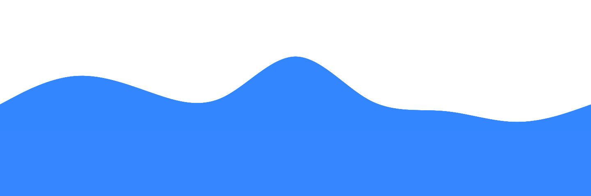

<!-- 

    

 -->

<link rel="preconnect" href="https://fonts.googleapis.com">
<link rel="preconnect" href="https://fonts.gstatic.com" crossorigin>
<link href="https://fonts.googleapis.com/css2?family=Black+Han+Sans&family=Madimi+One&family=Noto+Sans+KR&display=swap" rel="stylesheet">

  <h1 style="font-family: 'Madimi One', sans-serif;"> Hi, I'm Yuncheol Kwak </h1>

###

  
  

###

  
  
  
  
  
  

### 

- 👀 I’m interested in ...
- 🌱 I’m currently learning ...

  

<!---
YunDo-Gi/YunDo-Gi is a ✨ special ✨ repository because its `README.md` (this file) appears on your GitHub profile.
You can click the Preview link to take a look at your changes.
--->
